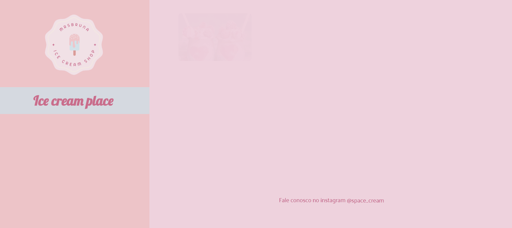

# SpaceCream

##

> Grid

Project developed using animation styles and grid concepts, focused on responsive layout.

The page was made for devices with different screen widths. It has two breakpoints: 700px and 900px.

> Mobile Version

At first we have the mobile version, that brings a display grid applied to the cards section,
with flex direction column positioning the cards one below the other.

##

> 700px screen width

Here we got the first breakpoint, 700px above, the cards section has a grid template area, containing two columns and four rows.

##

> 900px screen width

Here the cards section has a template area with four rows and three columns, the first three rows has three cards placed side by side and the fourth last one is filled by the footer.

> Animation

In the application's animation the transform: translateY property was applied, moving the elements on the vertical axis.

🔗 [Click here to access](https://brunasbarbosa.github.io/Space-cream/)
## ⚙️ Technologies
- HTML
- CSS
- Git and Github

## ​💌 Contact me

&nbsp;
&nbsp;
&nbsp;

